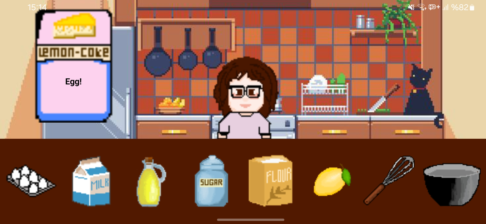

# 🍋🍰 Lemon Cake
A mini mobile game built with React Native featuring drag-and-drop mechanics

## About the Project

This project was developed as a practice exercise to improve skills in gesture handling, animations, layout measurement, state management, and audio integration within the React Native ecosystem. The player drags and drops various ingredients into a bowl to prepare a lemon cake. The project focuses on combining gestures and animations, which are commonly used in mobile game development.



## ⭐ Features

- Drag-and-drop mechanic (Gesture Handler + Reanimated)
- Simple step-based game flow
- Visual feedback for correct ingredients
- High-performance animations using Reanimated
- Background music and sound effects
- Fully hand-drawn characters, UI elements, and assets

## 💻 Technologies Used

- React Native
- Expo Router
- React Native Reanimated
- React Native Gesture Handler
- Expo AV (audio)

## 🎨 Design

All characters, ingredients, UI components were fully hand-drawn by me.


## 🚀 Installation and Running

```
# Install dependencies
npm install

# Start Expo development server
npx expo start

# Run on iOS simulator
npx expo start --ios

# Run on Android emulator
npx expo start --android
```
